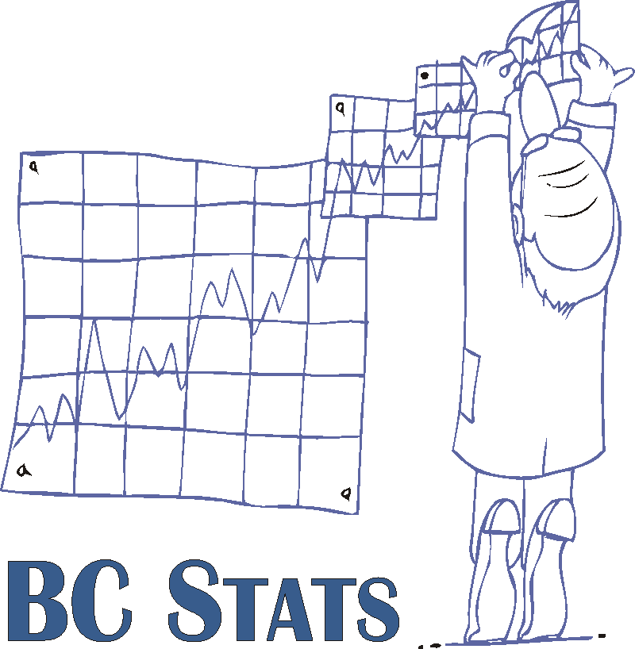

Using R to Make a Workflow More Efficient: Work Environment Survey
========================================================
autosize: true

Stephanie Yurchak   
October 11, 2018

Background
========================================================
type:section

Similar to the BC Public Service Work Enviornment Survey (WES), BC Stats runs several smaller surveys to external clients

Two main report types:

 

Inital state of these pojects
========================================================
type:section

Process:

Issues:

1. Run by different employees at BC Stats
  + Minimal standardization
  + Lack of version control
2. Report generation done by an individual IT resource for all projects

Tackling Version Control/Standardization
========================================================
type:section

- Template project folders  

- Template syntax in SPSS and Excel files with updateable formulas  

Results:
- Clearer direction on steps required for data processing and reporting
- Shortest time with least issues for report generation by in-house IT in 12 years!
 

Report generation: Work unit tables
========================================================
type:section

- Packages: haven, xlsx
- Inputs: SPSS dataset, Excel "Questions" file
- Customization: at the top of the program, or with Excel inputs
- Output: Formatted excel tables with multiple tabs, autofilters and freeze panes

Report generation: Work unit tables
========================================================
type:section

Report generation: Work unit tables
========================================================
type:section

Report generation: Work unit tables
========================================================
type:section

Report generation: PDF reports
========================================================
type:section

How to recreate our highly formatted report appearance?

With R and LaTeX!

 

Current state of these projects
========================================================
type:section

Initial Process:

Current Process:

Conclusion
========================================================
type:section

Workflow enhancements:
- Clear direction and consistency across projects run by different people
- No longer reliant on one person to produce all reports

Next steps:
- Using Rprojects and git for version control
- Extracting survey data from CallWeb directly into R for data processing
- Looking at web based reporting in R

Thanks!
========================================================
type:prompt

Any questions?

Stephanie.Yurchak@gov.bc.ca
